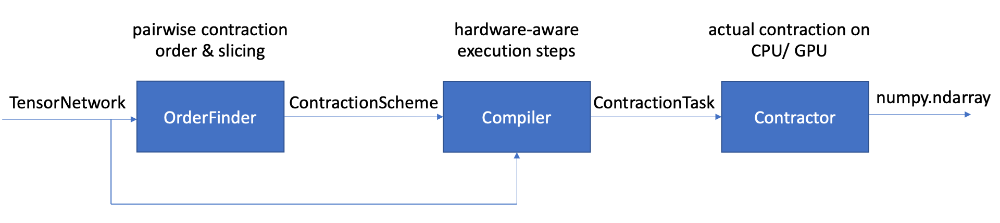

Tensor network and its contractions
===================================

This page serves as documentation for our main tensor network contraction engine.

===========
Overview
===========

.. contents::
   :depth: 1
   :local:
   :backlinks: none

.. highlight:: console

=====================
Tensor Valued Objects
=====================

A tensor is a multi-dimensional array of numbers. The number of dimensions associated to a tensor is called the `rank` of the tensor. For example, a tensor of rank 0 represent a scalar :math:`T`. A tensor of rank 1 is a vector :math:`(T_i)_{i=0}^{d-1}`, and a tensor of rank 2 is a matrix :math:`(T_{ij})_{(i,j)\in [d_0]\times [d_1]}`. The dimension corresponds to each of the indices are called `bond dimensions` associated to the indices.

A tensor network represents a multi-linear map of multiple tensors that results in a new tensor. For example:

* The inner product of two vectors :math:`U, V` can be expressed as :math:`T = \sum_i U_i\cdot V_i`.
* The outer product of two vectors :math:`U, V` can be expressed as :math:`T_{ij} = U_i\cdot V_j`.
* The element-wise product of two vectors :math:`U, V` can be expressed as :math:`T_i = U_i\cdot V_i`.
* The matrix product of two matrices :math:`M, N` can be expressed as :math:`T_{ij}=\sum_k U_{ik}\cdot V_{kj}`.

Explicit expressions like above are good for sake of demonstrations, but more complex tensor networks could arise from various scenarios, including many-body physics, machine learning and quantum computation. There are several equivalent ways of expressing a tensor network:

* Einstein summation. An einstein summation takes the form `[indices_0],[indices_1],...,[indices_k]->[indices_o]`. Each term on the left hand side corresponds to the indices configuration of an operand, and the indices on the right hand side corresponds to the indices on the right hand side, also called the open indices. All matching indices are identified with each other, and the closed indices, i.e. the ones that do not appear on the right hand side, are being summed over. The four examples above, expressed in terms of the Einstein summation, are respectively `i,i->`, `i,j->ij`, `i,i->i`, `ik,kj->ij`. There is a more restrictive interpretation of the einstein summation that each index appears exactly twice in the expression and the right hand side is thus removed. We do not take such convention. Moreover, each edge can appear multiple times on the right hand side, and does not have to appear on the left hand side as long as each index is associated with a definite bond dimension.
* Attributed Multi-hypergraph. A tensor network can be expressed as a multi-hypergraph, where each node corresponds to a tensor operand, and each hyperedge an index. This provides a graphical, intuitive representation of a tensor network.

Our package not only supports the definition and manipulation of tensors and tensor networks, but also unary functions acting on a tensor and summation of tensors with the same shape. These extensions help us handle different scenarios where tensors appear naturally in an easier manner.

.. autoclass:: acqdp.tensor_network.TensorValued
   :members: is_ready, is_valid, shape, contract, cast, fix_index

.. autoclass:: acqdp.tensor_network.Tensor
   :members: __init__
   :show-inheritance:

.. autoclass:: acqdp.tensor_network.TensorSum
   :members: __init__, add_term, update_term, remove_term
   :show-inheritance:

.. autoclass:: acqdp.tensor_network.TensorView
   :members: __init__
   :show-inheritance:

.. autoclass:: acqdp.tensor_network.TensorNetwork
   :members: add_node, pop_node, update_node, remove_node, add_edge, rewire, fix_edge, open_edge, close_edge, merge_edges, find_order, compile, contract
   :show-inheritance:

==================================
Tensor Network Contraction Related
==================================

Given the tensor operands and the network hypergraph as inputs, `tensor network contraction` aims to evaluation of the tensor network. Tensor network contraction is a computationally hard problem (:math:`\#P-complete`), but cleverly contracting intermediate-sized tensor networks are of great interest.

Our packages aims at efficient `exact` tensor network contraction, i.e. no approximation is made throughout the process. The contraction process consists of the following steps: order finding, runtime compilation and contraction.

----------------
Order finding
----------------

One way of tensor network contraction is to merge two tensor nodes into one at a time, until only one tensor is left as the outcome. The cost for such method is determined by the stepwise cost. Such method can be formulated as a binary contraction tree with each node representing a pairwise contraction step. Our algorithm uses the method first introduced in [GK20]_ to construct efficient contraction trees using hypergraph decomposition. A preliminary order finding scheme is given in :class:`OrderFinder` when the tensor network is relatively small. :class:`OptEinsumOrderFinder` provides more choices of order finding methods implemented in the `opt_einsum` package. More advanced, hypergraph-decomposition-based order finding approach is given in :class:`KHPOrderFinder`.

Sometimes, a fully serialized contraction tree can be too costly to be carried out due to time / space constraints; for a complex tensor network, it is possible that whatever contraction tree one finds would result in an intermediate result that is well beyond the space of a laptop. We introduced the idea of index slicing in [CZH+18]_ for parallelization that helps both on running the contraction scheme concurrently, and on relieving the hard space constraint. The slicing method is provided in the class :class:`Slicer`, and integrated to the order finding scheme as :class:`SlicedOrderFinder`.

As a result of its execution, a call to `find_order` would yield :class:`ContractionScheme`.

.. autoclass:: acqdp.tensor_network.ContractionScheme

.. autoclass:: acqdp.tensor_network.OrderFinder
   :members: find_order

.. autoclass:: acqdp.tensor_network.OptEinsumOrderFinder
   :show-inheritance:

.. autoclass:: acqdp.tensor_network.KHPOrderFinder
   :show-inheritance:

.. autoclass:: acqdp.tensor_network.SlicedOrderFinder
   :show-inheritance:

.. autoclass:: acqdp.tensor_network.Slicer
   :members: slice

.. autoclass:: acqdp.tensor_network.MPSlicer
   :show-inheritance:

.. autoclass:: acqdp.tensor_network.LocalOptimizer
   :members: optimize

------------------------------
Runtime-specific optimizations
------------------------------

A good contraction scheme involving sliced edges and pairwise contraction order might seem appealing in theory, but further work needs to be done for fully unleash the potential of the hardware to carry out such contraction efficiently. The :class:`Compiler` aims to minimize the inefficiencies introduced by small-tensor operations, which take up a majority of number of steps and can not make full use of the existing hardwares. More specifically, :class:`Compiler` does the following processing to increase the overall efficiency.

* Pre-computation. A typical contraction order has a stem-branch structure, i.e. it consists of a majority of small tensor multiplications (i.e. branches), and a few operations involving a big tensor obsorbing small tensors step by step (i.e. the stem). It is often the case that the stem requires too much memory that slicing becomes necessary, but the branches would need to be computed many times as a result. Although this does not add too much in the theoretical cost, it takes up a large amount of total time. To avoid this, :class:`Compiler` moves the small tensor multiplications *before* slicing. As it only has to be done ones prior to all slicing, the inefficiencies caused by small tensor operation is almost entirely reduces. These small tensor operations are then called pre-computation as they happen before slicing and the contractions on the stem.

* Branch merging. A typical contraction step on the stem is that the stem tensor (typically a big one) absorbs a small one as a result of contracting the corresponding branch. The branch tensor is sometimes so small that the multiplication cannot make full use of the GPU to achieve high-efficiency tensor contraction. One way to get around this is to slightly relax the floating point operations constraint, and merge two adjacent tensors together to form a bigger tensor, and then contract it to the stem.

.. autoclass:: acqdp.tensor_network.ContractionTask
   :members: execute

.. autoclass:: acqdp.tensor_network.Compiler
   :members: compile
   :undoc-members:

------------
Contraction
------------

Finally, :class:`Contractor` makes use of GPU, with the help of `jax` and `opt_einsum` to further increase the efficiency.

.. autoclass:: acqdp.tensor_network.Contractor
   :members: execute

References
*************************

.. [GK20] Johnnie Gray, and Stefanos Kourtis, *Hyper-optimized tensor network contraction*, arXiv preprint arXiv:2002.01935, 2020.
.. [CZH+18] Jianxin Chen, Fang Zhang, Cupjin Huang, Michael Newman, and Yaoyun Shi, *Classical simulation of intermediate-size quantum circuits*, arXiv preprint arXiv:1805.01450, 2018.

